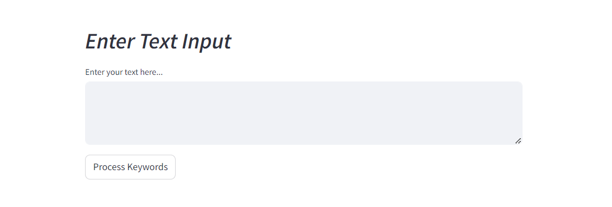
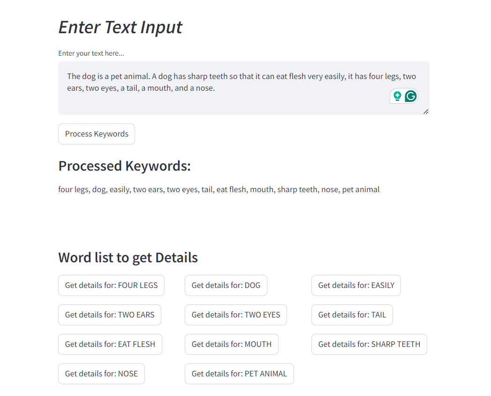

# Keyword Processor

Welcome to the Keyword Processor, a Streamlit application designed to extract keywords, fetch synonyms and antonyms, display definitions, and visualize relationships using dynamic word clouds.

## Overview

The Keyword Processor is a versatile tool for linguistic analysis and exploration of keywords within text. It leverages natural language processing techniques to extract meaningful keywords, retrieve their synonyms and antonyms via APIs, and provide detailed definitions. The application offers an interactive interface through Streamlit, allowing users to input text, process keywords, and explore linguistic details seamlessly.

## Features

- **Keyword Extraction**: Utilizes the RAKE algorithm to extract significant keywords from input text.
- **Synonyms and Antonyms**: Fetches synonyms and antonyms for each keyword using external APIs.
- **Definitions**: Retrieves detailed definitions of keywords from a dictionary API.
- **Word Cloud Visualization**: Dynamically generates word clouds to visually represent synonyms and antonyms.
- **Interactive Interface**: Offers a user-friendly interface with interactive buttons and real-time updates.

## Screenshots

### 1. Base Interface



*Description: Initial interface where users can input text and interact with the application.*
###
### 2. After Clicking the "Process Keywords" Button



*Description: Interface after processing keywords, displaying the processed keywords.*
###
### 3. After Clicking ope of the "Get details for" Button


*Description: Interface showing details such as definitions, synonyms, and antonyms for a selected keyword.*

## Usage

1. **Installation**:
   - Clone the repository:
     ```bash
     git clone https://github.com/Nafi7393/Keyword-Processor.git
     cd Keyword-Processor
     ```
   - Install dependencies:
     ```bash
     pip install -r requirements.txt
     ```

2. **Running the Application**:
   - Launch the Streamlit app:
     ```bash
     streamlit run main.py
     ```
   - Open the provided URL in your web browser to access the application.

3. **Using the Application**:
   - Enter text in the input area and click **Process Keywords** to extract and display keywords.
   - Click on **Get details** buttons next to keywords to fetch synonyms, antonyms, and definitions.
   - Explore visualizations and detailed information for each keyword.

## Contributing

Contributions are welcome! If you have suggestions, feature requests, or bug reports, please open an issue or submit a pull request.

##